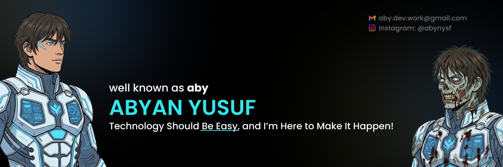

<!-- Header Banner -->

<!-- Typing SVG -->

  

## About Me

Hey, I'm **Abyan** - a Software Engineering student at Universitas Gadjah Mada (UGM) in Indonesia.

- Currently transitioning into **Web3 development**
- 13 months of fintech experience under my belt
- Always exploring the intersection of design and code

## Tech Stack

  

## GitHub Stats

  
  

  

## Contribution Snake

  

## Connect

  
  

---

  

